# Project: Behavioral Cloning

This project has been prepared by Andre Strobel.

The goal of this project is to use a convolutional neural network (CNN) to steer a car around a simulated track. The CNN must learn its behavior from a user driving the car around the same track in the simulator.

Everything has been programmed in Python 3 using Tensorflow, Keras and the Udacity Self-Driving Car Engineer Simulator.

The following table shows an overview of the most important files:

| File                                          | Description                                                             |
|-----------------------------------------------|-------------------------------------------------------------------------|
| 180825_StAn_Behavioral_Cloning_writeup.md     | This file                                                               |
| behavioral_cloning4.py                        | All scripts necessary to create the Keras model                         |
| 180823_StAn_CarND-Behavioral-Cloning-P3.ipynb | Jupyter notebook for executing behavioral_cloning4.py                   |
| model.h5                                      | Keras model for final submission (same as model_inf_005_wm_c5_d4_wd.h5) |
| model_inf_005_wm_c5_d4_wd.h5                  | Keras model using all training data and soft steeroffset = 0.05         |
| model_inf_020_wm_c5_d4_wd.h5                  | Keras model using all training data and aggressive steeroffset = 0.2    |
| drive.py                                      | Drive file for final submission (same as drive20.py)                    |
| drive20.py                                    | Python script to connect to simulator and drive with speed = 20         |
| drive9.py                                     | Python script to connect to simulator and drive with speed = 9          |
| videp.py                                      | Python script to create video (unchanged)                               |
| video.mp4                                     | Video for final submission (same as IMAGES_20_inf_005_wm_c5_d4_wd.mp4)  |
| IMAGES_20_inf_005_wm_c5_d4_wd.mp4             | Video with speed = 20 and soft steeroffset = 0.05                       |
| IMAGES_20_inf_020_wm_c5_d4_wd.mp4             | Video with speed = 20 and aggressive steeroffset = 0.2                  |
| IMAGES_9_inf_005_wm_c5_d4_wd.mp4              | Video with speed = 9 and soft steeroffset = 0.05                        |
| IMAGES_9_inf_020_wm_c5_d4_wd.mp4              | Video with speed = 9 and aggressive steeroffset = 0.2                   |

---

## Content

1. Setting up the simulator and training environment
    1. Data sources
    1. Hardware considerations
1. Capturing the behavioral training data
    1. Basic strategy
    1. Pre-processing of recovery data
    1. Augmentation of behavioral training data
1. Defining the model training pipeline using generators
    1. Generator creation
    1. Flexible model definition
1. Selecting the model architecture and hyperparameters
    1. Considered model variations
    1. Hyperparameter tuning
1. Evaluating the model bahavior
    1. What does underfitting and overfitting mean in this example?
    1. Which model architecture and what parameters worked best?
1. Discussion

[//]: # (Image References)

[image1]: docu_images/01_02_center_2018_08_18_06_11_22_467.jpg
[image2]: docu_images/01_02_center_2018_08_18_06_11_22_467_cropped.jpg
[image3]: docu_images/01_02_center_2018_08_18_06_11_22_467_flipped.jpg
[image4]: docu_images/04_01_mse_loss_index.png
[image5]: docu_images/07_01_nm_bridge_stuck.jpg

---

## 1. Setting up the simulator and training environment

### 1. Data sources

My goal is to be able to work on similar projects using my own hardware in the future. Therefore, I did not use the provided workspace nor an [AWS instance](https://aws.amazon.com/).

I installed [Anaconda](https://anaconda.org/) and defined a `tensorflow_GPU` environment with a *Jupyter* *notebook* and *jupyterlab*. Then I installed [Tensorflow](https://www.tensorflow.org/) and [Keras](https://keras.io/) in this `tensorflow_GPU` environment.

```
conda create -n tensorflow_GPU pip python=3.5 anaconda
activate tensorflow_GPU
pip install --ignore-installed --upgrade tensorflow-gpu
pip install keras-gpu
```

In order to use the Keras `keras.utils.plot_model` function I also had to manually install the `pydot` and `graphviz` packages in the `tensorflow_GPU` environment. For `graphviz` to work on my Windows 10 computer, I also had to install the [GraphViz](https://www.graphviz.org/download/) tools and set the Windows path to point to these executables.

A Windows executable for the [Udacity Self-Driving Car Simulator](https://github.com/udacity/self-driving-car-sim) can be found [here](https://d17h27t6h515a5.cloudfront.net/topher/2017/February/58983318_beta-simulator-windows/beta-simulator-windows.zip). In the following sections I will refer to this simply as *simulator*.

In order to run the *simulator* in conjunction with a provided `drive.py` Python script in *Autonomous Mode*, I also needed to manually install the `socketio` package in the `tensorflow_GPU` environment.

### 2. Hardware considerations

I strongly recommend using a GPU for running the *simulator* in conjunction with the `drive.py` Python script in *Autonomous Mode*. I am using an *NVIDIA GeForce GTX 1060 6 GB* graphics card for this. If I run the *simulator* without a GPU on an *Intel i7* platform with the fastest low resolution settings, I will experience response time issues between the *simulator* and the Python `drive.py` script. The Python `drive.py` script itself does not require a GPU.

In order to read images quickly from the hard disk during training, I highly recommend to use a fast *M.2 Solid-State Drive*. Compared to running it on a fast network attached storage this sped up the training process from many hours to a few minutes.

## 2. Capturing the behavioral training data

### 1. Basic strategy

Recording data in the *simulator* will save a sequence of images (center view, left view, right view) as well as the corresponding  measurements for steering angle, throttle, braking and speed.

The goal of this project is to have a car drive in the center of the provided track. Hence, collecting data of good center driving is essential. This will train the model on which steering angle to choose when seeing a specific image in the center view. The left and right views can be used to augment the training data with views that require a slight steering adjustment to get back to the center line. In the following the slight steering adjustment is defined by the parameter `steeroffset` (value greater or equal to 0). The following images show a left, center and right view of the same training data set. The steering angle `steering_angle` is a value between -1 and 1. A slightly negative value demands a slight steering to the left. The car uses maximum throttle for `throttle` (value between 0 and 1), no braking for `braking` (value between 0 and 1) and drives with a maximum speed `speed` (value between 0 and 30-ish).

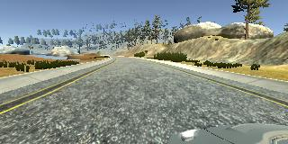 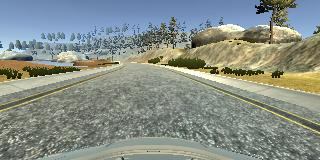 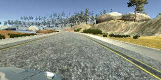

```
left view: steering_angle = -0.03759398 + steeroffset
center view: steering_angle = -0.03759398
right view: steering_angle = -0.03759398 - steeroffset
throttle = 1
braking = 0
speed = 30.19014
```

The algorithm should focus on the road itself and not on objects in the environment. The basic strategy does not include to initiate specific driving actions when e.g. a specific tree is seen on the side of the road. Therefore, all the images will be cropped at the top and bottom as shown in the following.

![alt text][image1] ![alt text][image2]

### 2. Pre-processing of recovery data

Although the center line training includes center line driving and a soft version for recovery, the car will eventually drift away from the center line due to either varying initial conditions, changing environments or prediction errors. Therefore, a stronger version for recover is needed when the car gets close to the boundaries of the driveable track.

We need to train the model to steer away from the track boundary if the car gets too close to it. We can record the necessary steering angle based on the behavior of a real driver by driving on the track and continuously weaving from left to right. Then we pre-process this recovery data to only consider images that steer the car away from the boundary. We don't want to train the model to steer towards the track boundary. We also don't want to train the model to cross over the center line with a steering angle that moves the car away from the center line like we do during the weaving events.

As the measurements are recorded in a *\*.csv* format I conveniently used *Microsoft Excel* to mark the rows that contain valid recovery situations during the weaving events. A valid recovery situation is determined as being part of the first third of an event when the steering wheel clearly changes from left to right steering or the other way round. The second third would be considered crossing the center line and the last third would be considered steering towards the closest boundary. Here are examples for first, second and last third images of a single event as decribed before along with their steering angles.

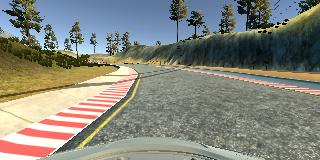 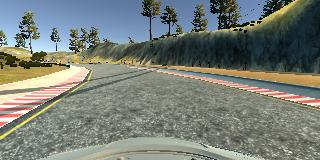 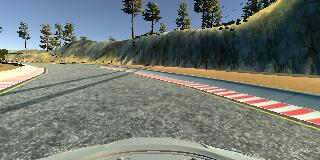

```
first third: steering_angle = 0.2406015
second third: steering_angle = 0.2330827
last third: steering_angle = 0.2030075
```

The following table shows the columns of the *\*.csv* file and the values that they contain.

| Row number | Column D | Column E | Column F | Column G |
|------------|----------|----------|----------|----------|
| 6 | \<steering angle\> | \<throttle\> | \<braking\> | \<speed\> |

The next table shows the formulas I used to mark the valid recovery situations starting in row 6. Row 1 to 5 cannot contain valid situations. Column I is used to identify whether the new steering angle is part of a recovery (1 if yes and 0 if not) from the right (steering angle larger than the average of the last 5 events or steering angle negative) or the left (steering angle smaller than the average of the last 5 events or steering angle positive) side. Column J increases the counter for how many steps the most recent recovery already took by 1 if a recovery takes place - counting from the end to the beginning. Column K divides column J by 3 and is used by column L to count down by 1 step each row. Column M uses this information to return 1 if the current row is part of the first third of the latest recovery event and 0 otherwise.

| Row number | Column I | Column J | Column K | Column L | Column M |
|------------|----------|----------|----------|----------|----------|
| 6 | =IF(OR(AND(D6>=AVERAGE(D1:D5),D6<0),AND(D6<=AVERAGE(D1:D5),D6>0)),1,0) | =IF(I6=0,0,J7+I6) | =IF(J6=0,0,J6/3) | =IF(K6=0,0,IF(AND(K5=0,K6>0),K6,L5-1)) | =IF(L6>=1,1,0) |

Columns H to L are deleted before exporting the *Microsoft Excel* file to a *\*.csv'* file. Column M stays and is read as variable `btake` for each center, left and right view image.

### 3. Augmentation of behavioral training data

To further augment the training data I also drove the track in the opposite direction - using center line driving and weaving.

Each image can be used as is and horizontally flipped. The sign of the steering angle of the flipped image must also be flipped to maintain a valid training data set. Here is an example of a original and flipped image and their steering angles.

![alt text][image1] ![alt text][image3]

```
original center view: steering_angle = -0.03759398
flipped center view: steering_angle = 0.03759398
```

With the before mentioned training data the car tends to either stay in the center, drift to the boundaries or recover hard from the boundaries. This can be problematic when the car drives faster. Therefore, an additional medium recovery dataset was recorded in both directions by weaving around the center line. The same pre-processing was applied as decribed in the section before.

A further step would be to shift the image left and right, adjust the steering angle accordingly to encourage center driving  and regenerate the sides of the image using an [auto-encoder](https://blog.keras.io/building-autoencoders-in-keras.html) that has been trained on the complete training dataset. This has not been implemented yet.

The total number of recorded training datasets is shown in the following table. The columns contain the numbers of center, left and right view images in original and flipped state. The rows contain the numbers for the individual recordings of track `track1`. Each loop on `track1` needed to be split into 2 separate recordings, because recording the full loop at once sometimes led to an error. The center line driving is recorded as `center` and `counter` for the opposite direction. The strong recovery weaving is recorded as `weave` and `ceave` for the opposite direction. The medium recovery weaving is recorded as `meave` and `deave` for the opposite direction. Although many invalid images are ignored during the recovery weaving recordings, the total number is still high, because these loops are driven at much slower speeds. 

```
Number of image files: 88020

                 center  centerflipped  left  leftflipped  right  rightflipped
track1_center1     1325           1325  1325         1325   1325          1325
track1_center2     1289           1289  1289         1289   1289          1289
track1_counter1    1287           1287  1287         1287   1287          1287
track1_counter2    1327           1327  1327         1327   1327          1327
track1_weave1      2106           2106  2106         2106   2106          2106
track1_weave2      1162           1162  1162         1162   1162          1162
track1_ceave1       631            631   631          631    631           631
track1_ceave2      1918           1918  1918         1918   1918          1918
track1_meave1      1064           1064  1064         1064   1064          1064
track1_meave2       857            857   857          857    857           857
track1_deave1       738            738   738          738    738           738
track1_deave2       966            966   966          966    966           966
```

## 3. Defining the model training pipeline using generators

I developed a very flexible model setup and training pipeline that uses generators for effective data handling. With this I can try different model configurations by simply varying parameters. The complete pipeline is based on the following Python packages, functions and objects. The example code sections that are listed below don't require all of them.

```python
# import packages
import glob
import os
import csv
import cv2
import numpy as np
from sklearn.utils import shuffle
from sklearn.model_selection import train_test_split
import matplotlib.pyplot as plt
from keras.models import Sequential
from keras.layers import Cropping2D, Lambda, Flatten, Dropout, Dense
from keras.layers.convolutional import Conv2D
from keras.layers.pooling import MaxPooling2D
from keras import regularizers
from keras.utils import plot_model
import pandas as pd
```

### 1. Generator creation

The training datasets are determined by the function `get_data`. This function returns 3 lists: `imagefiles` contains all training image file names, `measurements` contains all measurements for the training images and `bmustflip` contains the info whether or not the image must be flipped. It also returns the size of the training images as `ysize` for the height in pixels and `xsize` for the width in pixels.

The actual content of the image files is loaded and pre-processed with the `get_data_generator` function. It loops infinitely over the dataset and shuffles it at the beginning before going through it again and again. The output `X_data` contains as many images as defined by `batch_size`. The output `y_data` contains the measurements for these images (only the steering angle in this example).

The parameter `valid_percentage` defines how much of the dataset is used for validation leaving the rest for training. In this example 20 percent of the complete dataset is reservered for validation. Separate generators are created for training (`train_generator`) and validation (`valid_generator`) images.

```python
def get_data_generator(imagefiles, measurements, bmustflip, batch_size):
# ...
# Retrieve all input data
# ...
# Inputs
# ...
# imagefiles   : image files for training
# measurements : related measurements for training
# bmustflip    : boolean for 'image must be flipped'
# batch_size   : batch size which is returned for each next call
# ...
# Outputs via yield
# ...
# X_data : x values for training
# y_data : y values for training
    
    # define constants
    measurement_range = [0] # only take the first measurement (steering angle)
    
    # loop forever so the generator never terminates
    while 1:
        
        # shuffle inputs each time this loop restarts
        shuffle(imagefiles, measurements, bmustflip)
        
        # loop through all batches
        for offset in range(0, len(imagefiles), batch_size):
            
            # get batch input data
            batch_imagefiles = imagefiles[offset:(offset + batch_size)]
            batch_measurements = [measurement[index] for measurement in measurements[offset:(offset + batch_size)] \
                                  for index in measurement_range]
            batch_bmustflip = bmustflip[offset:(offset + batch_size)]
            batch_bmustautoencode = bmustautoencode[offset:(offset + batch_size)]
            
            # loop through all images
            batch_images = []
            for batch_imagefile, batch_bmustflipit in zip(batch_imagefiles, batch_bmustflip):
                
                # read image
                image = read_image(batch_imagefile)
                
                # flip image if required
                if batch_bmustflipit:
                    image = np.fliplr(image)
                    
                # add image to output
                batch_images.append(image)
            
            # calculate outputs
            X_data = np.array(batch_images)
            y_data = np.array(batch_measurements)
            
            yield X_data, y_data

# define constants
subfolder = '../../GD_GitHubData/behavioral-cloning-data'
valid_percentage = 0.2
steeroffset = 0.05
batch_size = 32
bdisplay = True

# retrieve input data
imagefiles, measurements, bmustflip, ysize, xsize = get_data(subfolder, steeroffset, bdisplay)

# need to shuffle and split into training and validation data
imagefiles_train, imagefiles_valid, measurements_train, measurements_valid, bmustflip_train, bmustflip_valid, = train_test_split(imagefiles, measurements, bmustflip, test_size = valid_percentage)
train_size = len(imagefiles_train)
valid_size = len(imagefiles_valid)
display_size = len(imagefiles)

# define data generators to retrieve batches for training and validation
train_generator = get_data_generator(imagefiles_train, measurements_train, bmustflip_train, batch_size, [0, ysize])
valid_generator = get_data_generator(imagefiles_valid, measurements_valid, bmustflip_valid, batch_size, [0, ysize])
```

### 2. Flexible model definition

The model can be defined as sequence of convolutional layers followed by a sequence of fully connected layers. In order to define the layers the following classes have been defined:

1. `ConvLayer` for a single convolutional layer
1. `FullLayer` for a single fully connected layer
1. `ModelParameters` for the model itself

A convolutional layer is defined by the number of features (`features`), the filter size (`filter_size`), the number of strides in each dimension (`strides`) as well as whether or not *max pooling* is used (`busepooling`).

A fully connected layer is defined by the number of features (`features`) and the percentage of connections that should be kept (`keep_percentage`). If `keep_percentage` is less than 1, a *dropout* layer is added.

The model takes a list of convolutional layers (`conv_layers`: list of objects of class `ConvLayer`), fully connected layers (`full_layers`: list of objects of class `FullLayer`) and a `regularizer` object as inputs. The `regularizer` can either be `None` or a `keras.regularizers` object. The `regularizer` is applied to the kernel weights of each convolutional layer.

```python
class ConvLayer:
# ...
# Parameters used to define the structure of a convolutional layer
# ...
    
    features = 1
    filter_size = (5, 5)
    strides = (2, 2)
    busepooling = False
    
    def __init__(self, features, filter_size, strides, busepooling):
        self.features = features
        self.filter_size = filter_size
        self.strides = (1, 1) if (strides == None) else strides
        self.busepooling = busepooling

class FullLayer:
# ...
# Parameters used to define the structure of a full layer
# ...
    
    features = 1
    keep_percentage = 1
    
    def __init__(self, features, keep_percentage):
        self.features = features
        self.keep_percentage = keep_percentage

class ModelParameters:
# ...
# Parameters used to define the structure of the convolutional neural network
# ...
    
    conv_layers = []
    full_layers = []
    regularizer = None
    
    def __init__(self, conv_layers, full_layers, regularizer):
        self.conv_layers = conv_layers
        self.full_layers = full_layers
        self.regularizer = regularizer
```

The following parameters define a model in the variable `sMP` that has 5 convolutional layers and 4 fully connected layers. This layout follows what was suggested during the Udacity Self-Driving Car Engineer class following a model used by the NVIDIA autonomous vehicle group. The 5 convolutional layers are capable of detecting the most important features in an image of the size 320x65 pixels. The 4 fully connected layers are capable of reducing 2112 features to a single steering angle as output. The model size is large enough to accomodate L2 regularization in the convolutional layers and 50 percent dropout in the first 3 fully connected layers.

```python
# define constants
iternames = []
sMPs = []

# define parameters for configuration 0
iternames.append('c5_d4_wd')
conv_layers = []
conv_layers.append(ConvLayer(features = 24, filter_size = (5, 5), strides = (2, 2), busepooling = False))
conv_layers.append(ConvLayer(features = 36, filter_size = (5, 5), strides = (2, 2), busepooling = False))
conv_layers.append(ConvLayer(features = 48, filter_size = (5, 5), strides = (2, 2), busepooling = False))
conv_layers.append(ConvLayer(features = 64, filter_size = (3, 3), strides = None, busepooling = False))
conv_layers.append(ConvLayer(features = 64, filter_size = (3, 3), strides = None, busepooling = False))
full_layers = []
full_layers.append(FullLayer(features = 100, keep_percentage = 0.5))
full_layers.append(FullLayer(features = 50, keep_percentage = 0.5))
full_layers.append(FullLayer(features = 10, keep_percentage = 0.5))
full_layers.append(FullLayer(features = 1, keep_percentage = 1))
sMPs.append(ModelParameters(conv_layers = conv_layers.copy(), full_layers = full_layers.copy(), \
                            regularizer = regularizers.l2(0.01)))
```

The function `train_model` is used to create and train a model. The model definition is passed to this function via the previously described variable `sMP`. First it defines a new `Sequential()` *Keras* model. In the next step it crops the top and bottom from the image as described before. Using the *Keras* layer `Cropping2D` as part of the model ensures that the same cropping occurs if the model is later used to predict the steering angle. After this the input is normalized in a *Keras* `Lambda` layer from values between 0 and 255 to values between -0.5 and 0.5. The next two steps create the convolutional layers and then add a flatten layer before creating all the fully connected layers.

The layout of the model is plotted to an image file via the `plot_model` function from `keras.utils`.

The model is created by selecting the `mse` (mean square error) loss function and an `adam` optimizer for training. The actual training happens in the `fit_generator` function. It takes the training dataset from the generator `train_generator` and the validation dataset from the generator `valid_generator` that have been defined before. The number of epochs `epochs` is also passed to this function. The final model is then saved to a file.

```python
def train_model(itername, train_generator, train_size, valid_generator, valid_size, \
                batch_size, yimagerange, ysize, xsize, epochs, modelfilename, modelfileext, modellayoutpicfilename, \
                modellayoutpicfileext, sMP):
# ...
# Train model
# ...
# Inputs
# ...
# itername               : name of training iteration
# train_generator        : variable pointing to function that retrieves next values from training generator
# train_size             : total number of training data sets
# valid_generator        : variable pointing to function that retrieves next values from validation generator
# valid_size             : total number of validation data sets
# batch_size             : batch size
# yimagerange            : range of pixels used from source images in vertical direction
# ysize                  : source image height in pixels
# xsize                  : source image width in pixels
# epochs                 : number of epochs
# modelfilename          : file name in which model will be saved
# modelfileext           : file extension for file in which model will be saved
# modellayoutpicfilename : picture file in which model layout will be stored
# modellayoutpicfileext  : file extension for picture file in which model layout will be stored
# sMP                    : object containing model parameters that define the model layout
    
    # define Keras model
    model = Sequential()
    
    # define Keras input adjustments
    model.add(Cropping2D(cropping = ((yimagerange[0], (ysize - yimagerange[1])), (0, 0)), input_shape = (ysize, xsize, 3)))
    model.add(Lambda(lambda x: (x / 255.0) - 0.5, \
                     input_shape = (3, (ysize - (yimagerange[0] + (ysize - yimagerange[1]))), xsize)))
    
    # define Keras convolutional layers
    for conv_layer in sMP.conv_layers:
        model.add(Conv2D(conv_layer.features, conv_layer.filter_size[0], conv_layer.filter_size[1], \
                         subsample = conv_layer.strides, activation = "relu", kernel_regularizer = sMP.regularizer))
        if conv_layer.busepooling: model.add(MaxPooling2D())
    
    # define Keras dense layers
    model.add(Flatten())
    for full_layer in sMP.full_layers:
        if (full_layer.keep_percentage < 1): model.add(Dropout(full_layer.keep_percentage))
        model.add(Dense(full_layer.features))
    
    # print the layout of the model
    plot_model(model, to_file = (modellayoutpicfilename + '_' + itername + modellayoutpicfileext), show_shapes = True, \
               show_layer_names = True)
    model.summary()
    
    # generate model
    model.compile(loss = 'mse', optimizer = 'adam')
    
    # train model
    history_object = model.fit_generator(train_generator, samples_per_epoch = np.int(train_size // batch_size), \
                                         validation_data = valid_generator, \
                                         nb_val_samples = np.int(valid_size // batch_size), nb_epoch = epochs, verbose = 1)
                                         
    # save trained model
    model.save((modelfilename + '_' + itername + modelfileext))
```

The exact layer sizes and number of parameters for the above example are calculated by *Keras* via the model object method `summary()` as follows.

```
_________________________________________________________________
Layer (type)                 Output Shape              Param #   
=================================================================
cropping2d_1 (Cropping2D)    (None, 65, 320, 3)        0         
_________________________________________________________________
lambda_1 (Lambda)            (None, 65, 320, 3)        0         
_________________________________________________________________
conv2d_1 (Conv2D)            (None, 31, 158, 24)       1824      
_________________________________________________________________
conv2d_2 (Conv2D)            (None, 14, 77, 36)        21636     
_________________________________________________________________
conv2d_3 (Conv2D)            (None, 5, 37, 48)         43248     
_________________________________________________________________
conv2d_4 (Conv2D)            (None, 3, 35, 64)         27712     
_________________________________________________________________
conv2d_5 (Conv2D)            (None, 1, 33, 64)         36928     
_________________________________________________________________
flatten_1 (Flatten)          (None, 2112)              0         
_________________________________________________________________
dropout_1 (Dropout)          (None, 2112)              0         
_________________________________________________________________
dense_1 (Dense)              (None, 100)               211300    
_________________________________________________________________
dropout_2 (Dropout)          (None, 100)               0         
_________________________________________________________________
dense_2 (Dense)              (None, 50)                5050      
_________________________________________________________________
dropout_3 (Dropout)          (None, 50)                0         
_________________________________________________________________
dense_3 (Dense)              (None, 10)                510       
_________________________________________________________________
dense_4 (Dense)              (None, 1)                 11        
=================================================================
Total params: 348,219
Trainable params: 348,219
Non-trainable params: 0
_________________________________________________________________
```

## 4. Selecting the model architecture and hyperparameters

### 1. Considered model variations

The previously described model configuration `c5_d4_wd` worked very well right from the beginning. In order to understand why this is the case and whether there is a simpler version, I defined 3 more configurations that eliminated some of its characteristics step by step. The model configuration `c5_d4_nd` is very similar, but has no dropout layers in the fully connected section of the model. The model configuration `c2_d3_wd` only uses 2 convolutional layers. And the model configuration `c2_d3_nd` only uses 2 convolutional layers and has no dropout layers in the fully connected section of the model.

```
# define parameters for configuration 1
iternames.append('c5_d4_nd')
conv_layers = []
conv_layers.append(ConvLayer(features = 24, filter_size = (5, 5), strides = (2, 2), busepooling = False))
conv_layers.append(ConvLayer(features = 36, filter_size = (5, 5), strides = (2, 2), busepooling = False))
conv_layers.append(ConvLayer(features = 48, filter_size = (5, 5), strides = (2, 2), busepooling = False))
conv_layers.append(ConvLayer(features = 64, filter_size = (3, 3), strides = None, busepooling = False))
conv_layers.append(ConvLayer(features = 64, filter_size = (3, 3), strides = None, busepooling = False))
full_layers = []
full_layers.append(FullLayer(features = 100, keep_percentage = 1))
full_layers.append(FullLayer(features = 50, keep_percentage = 1))
full_layers.append(FullLayer(features = 10, keep_percentage = 1))
full_layers.append(FullLayer(features = 1, keep_percentage = 1))
sMPs.append(ModelParameters(conv_layers = conv_layers.copy(), full_layers = full_layers.copy(), \
                            regularizer = regularizers.l2(0.01)))

# define parameters for configuration 2
iternames.append('c2_d3_wd')
conv_layers = []
conv_layers.append(ConvLayer(features = 24, filter_size = (5, 5), strides = (2, 2), busepooling = False))
conv_layers.append(ConvLayer(features = 36, filter_size = (5, 5), strides = (2, 2), busepooling = False))
full_layers = []
full_layers.append(FullLayer(features = 100, keep_percentage = 0.5))
full_layers.append(FullLayer(features = 10, keep_percentage = 0.5))
full_layers.append(FullLayer(features = 1, keep_percentage = 1))
sMPs.append(ModelParameters(conv_layers = conv_layers.copy(), full_layers = full_layers.copy(), \
                            regularizer = regularizers.l2(0.01)))

# define parameters for configuration 3
iternames.append('c2_d3_nd')
conv_layers = []
conv_layers.append(ConvLayer(features = 24, filter_size = (5, 5), strides = (2, 2), busepooling = False))
conv_layers.append(ConvLayer(features = 36, filter_size = (5, 5), strides = (2, 2), busepooling = False))
full_layers = []
full_layers.append(FullLayer(features = 100, keep_percentage = 1))
full_layers.append(FullLayer(features = 10, keep_percentage = 1))
full_layers.append(FullLayer(features = 1, keep_percentage = 1))
sMPs.append(ModelParameters(conv_layers = conv_layers.copy(), full_layers = full_layers.copy(), \
                            regularizer = regularizers.l2(0.01)))
```

A graphical representation of the different model configurations is shown below. The elimination of several characteristics from left to right is clearly visible.

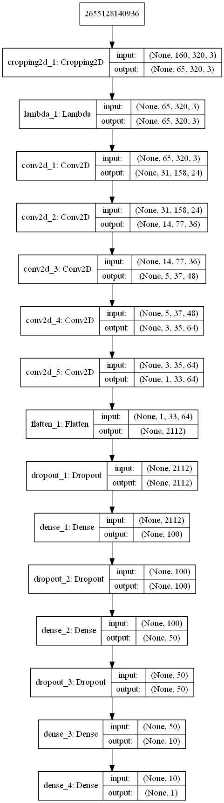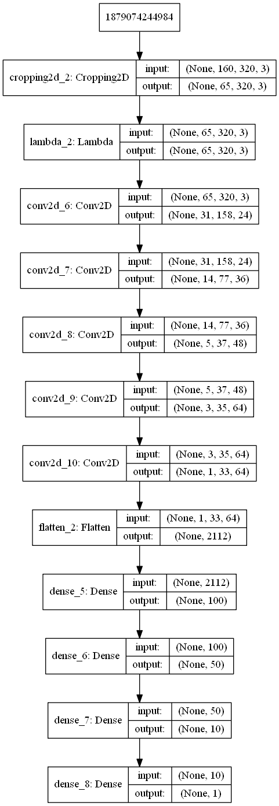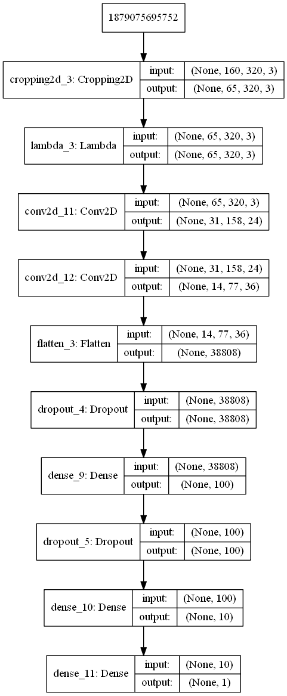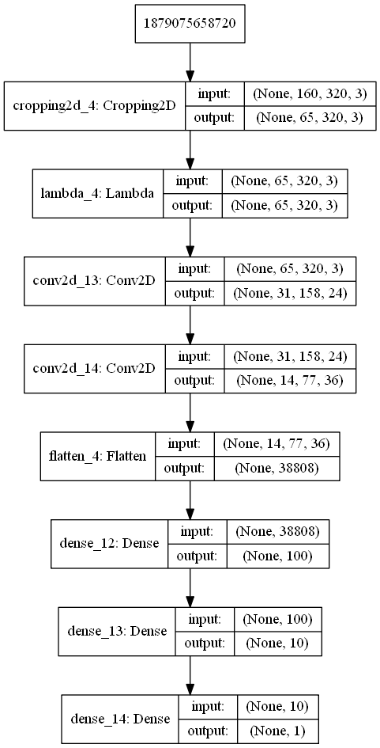

### 2. Hyperparameter tuning

The before described pipeline and model variations can be used and executed with the following code.

```
yimagerange = [70, 135]
max_train_size = 9999999999 # 256
max_valid_size = 9999999999 # 256
epochs = 3
modelfilename = 'model'
modelfileext = '.h5'
modellayoutpicfilename = 'model'
modellayoutpicfileext = '.png'

# train all desired model configurations
for itername, sMP in zip(iternames, sMPs):
    train_model(itername, train_generator, np.min([train_size, max_train_size]), valid_generator, \
                np.min([valid_size, max_valid_size]), \
                batch_size, yimagerange, ysize, xsize, epochs, modelfilename, modelfileext, modellayoutpicfilename, \
                modellayoutpicfileext, sMP)
```

The parameters `max_train_size` and `max_valid_size` are only used for debugging purposes to limit the training to a few iterations. The number of epochs `epochs` is the only hyperparameter that has not been defined yet. For the considered model configurations and the available training dataset 3 epochs lead to a low error without running unnecessary long and over-training the model. The below picture shows the training progress for model configuration `c5_d4_wd`. The other model configurations mentioned above show a very similar convergence.

![alt text][image4]

The batch size `batch_size` has been set to 32. Values significantly above 256 would require more epochs. I didn't look into this parameter any further as the results looked very good with a value of 32.

The dropout amount was varied between 0 and 0.5 by selecting the different model configurations. The effect is described further below.

The L2 regularization parameter was left at the default value of 0.01 which seemed to work well with previous convolutional neural network models before.

## 5. Evaluating the model bahavior

The behavior of the model can be evaluated with the *simulator* in *Autonomous Mode*. The first command needs to be executed to connect and then run the *simulator* with the model. The second command takes the recorded images and creates a video.

```python
python drive.py model.h5 IMAGES
python video.py IMAGES --fps 60
```

### 1. What does underfitting and overfitting mean in this example?

The first question I asked myself was how do I know whether my model is underfit or overfit?

Underfitting is comparably easy to explain. In this case the model does not react as intended, i.e. it cannot keep the car close to the center line and it cannot recover from the left and right boundaries. This becomes very obvious in turns and can be experienced by the car leaving the safe track surface.

Overfitting occurs when the model cannot generalize the input anymore. It knows exactly what to do when the trained input is provided. In this case it can either stay on the center line or recover from the boundaries in exactly the trained locations. An overfit model will not be able to recover in locations that it has not been trained for and it will not know what to do when it is not driving on the trained center line. Latter can lead to oscillations around the center line or from bounary to boundary. Not knowing how to recover in an untrained boundary location can lead to leaving the safe track surface.

I also attempted a very aggressive way to not overtrain the model. I limited the training data set to 256 random images only. The car started out very smooth and took the first turn in the center. It even drove over the bridge, but then nearly crashed into the block at the end of the bridge, because this obstacle clearly was not part of the small random training dataset.

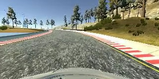 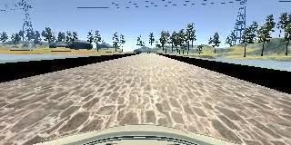 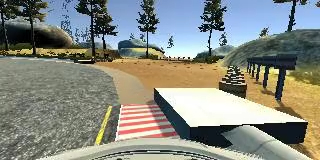

### 2. Which model architecture and what parameters worked best?

I quickly experienced that speed plays an important role. A model that works well at [lower speeds like 9](IMAGES_9_inf_020_wm_c5_d4_wd.mp4) does not necessarily work well at [higher speeds like 20](IMAGES_20_inf_020_wm_c5_d4_wd.mp4). As a human driver I was able to navigate through the whole track at the highest possible speed of 30 without too much effort. As most of my models worked well at a speed of 9 I decided to focus on the more challenging speed of 20 to clearly see behavioral differences.

Another important parameter is the `steeroffset`. It defines how soft or aggressive the model reacts to deviations from the center line. [Higher values](IMAGES_20_inf_020_wm_c5_d4_wd.mp4) introduce more oscillations around the center line. [Lower values](IMAGES_20_inf_005_wm_c5_d4_wd.mp4) can lead to drifting to the left and right boundaries. While the model is able to handle larger `steeroffset` values at lower speeds, this parameter must not be too large for higher speeds, because the oscillations can extend beyond the boundaries and the car leaves the track. To compensate the drifting behavior with smaller `steeroffset` values, I recorded the additional medium recovery dataset. With this the model can learn how to recover when it is away from the center line, but not yet at the boundaries.

All model configurations introduced above have been tested in combination with different settings for `speed`, the amount of images used for training, different values for `steeroffset` and whether or not to use a medium recovery dataset. Below is the naming convention for the individual test runs.

```
<speed>_<limit>_<steeroffset>_<medium>_<convolutions>_<full>_<dropout>

speed        : driving speed
limit        : number of images to which the training dataset was limited {256: small random number, inf: all images}
steeroffset  : value used as steering offset {0.05: soft, 0.20: aggressive, 0.40: very aggressive}
medium       : {wm: with medium recovery dataset, nm: no medium recovery dataset}
convolutions : number of convolutional layers
full         : number of fully connected layers
dropout      : {wd: with dropout, nd: no dropout}
```

The following configurations successfully drove a full lap on the track. This includes driving at a low speed of 9 and many of the configurations with a soft `steeroffset` value of 0.05. Even configurations with limited perception of features (less convolutional layers) were able to manage the track at a speed of 20 with a low `steeroffset` value of 0.05. Interestingly, at a speed of 20 even a `steeroffset` value of 0.2 worked for configurations that used the medium recovery dataset and dropout. 

| Successful configurations    | Percentage of safe driving |
|------------------------------|----------------------------|
| 9_inf_005_wm_c5_d4_wd        | 100%                       |
| 9_inf_020_wm_c5_d4_wd        | 100%                       |
| 20_inf_005_wm_c5_d4_wd       | 100%                       |
| 20_inf_005_wm_c5_d4_nd       | 100%                       |
| 20_inf_005_wm_c2_d3_wd       | 100%                       |
| 20_inf_005_wm_c2_d3_nd       | 100%                       |
| 20_inf_020_wm_c5_d4_wd       | 100%                       |
| 20_inf_020_wm_c2_d3_wd       | 100%                       |
| 20_inf_005_nm_c2_d3_wd       | 100%                       |

I consider the configuration `20_inf_005_wm_c5_d4_wd` the best, because it drives around the track in the smoothest way. There is still one location where it is challenged. This is the end of the long straight bridge. The car oscillates in the middle of the bridge from right to left and back to the right. When the track suddenly gets a little bit narrower at the end of the bridge it needs to steer more aggressively back to the center. This is shown in the following picture series.

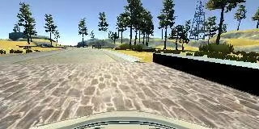 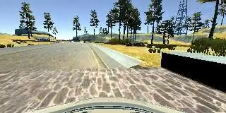 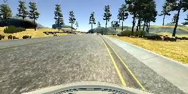

The configurations below did result in an unsave driving situation. The percentage value shows when the first unsafe situation occured during the first lap on the track.

| Unsuccessful configurations  | Percentage of safe driving |
|------------------------------|----------------------------|
| 20_inf_020_wm_c2_d3_nd       | 69%                        |
| 20_256_005_nm_c5_d4_wd       | 63%                        |
| 20_inf_005_nm_c5_d4_wd       | 45%                        |  
| 20_inf_040_wm_c5_d4_wd       | 42%                        |
| 20_inf_040_wm_c2_d3_wd       | 31%                        |
| 20_inf_005_nm_c2_d3_nd       | 26%                        |
| 20_256_005_nm_c5_d4_nd       | 25%                        |
| 20_inf_040_wm_c5_d4_nd       | 24%                        |
| 20_inf_020_wm_c5_d4_nd       | 24%                        |
| 20_256_005_nm_c2_d3_nd       | 19%                        |
| 20_inf_020_nm_c2_d3_wd       | 13%                        |
| 20_inf_020_nm_c5_d4_wd       | 12%                        |
| 20_inf_040_wm_c2_d3_nd       | 11%                        |
| 20_inf_020_nm_c5_d4_nd       | 10%                        |
| 20_inf_020_nm_c2_d3_nd       | 5%                         |
| 20_256_005_nm_c2_d3_wd       | 4%                         |

The first unsafe configuration `20_inf_020_wm_c2_d3_nd` encounters extreme oscillations, because of its limited perception of features (less convolutional layers) and because it cannot generalize enough (no dropout).

The next unsafe configuration `20_256_005_nm_c5_d4_wd` is kind of a surprise. It is based on a very limited random training dataset. As mentioned before it drives pretty smooth, but it also ignores some important features, obstacles and finally a sharp turn.

Configuration `20_inf_005_nm_c5_d4_wd` is oscillating extremely from boundary to boundary, because of the higher speed and not using a medium recovery dataset. Eventually it hits the side of the bridge and gets stuck.

![alt text][image5]

All the other unsafe configurations are facing on of the following deficiencies:

| Deficiency | Issue |
|------------|-------|
| A very aggressive `steeroffset` value of 0.4 | Too many oscillations and finally leaving the track or getting stuck on the side |
| No dropout and either no medium recovery dataset or an aggressive `steeroffset` value of 0.2 | Not generalized enough, too many aggressive maneuvers and finally leaving the track or getting stuck on the side |
| No medium recovery dataset and an aggressive `steeroffset` value of 0.2 | Too many oscillations with aggressive steering and finally leaving the track or getting stuck on the side |
| A very limited random training dataset, no medium recovery dataset and a limited perception of features (less convolutional layers) | Blind driver |

## 6. Discussion

TEXT